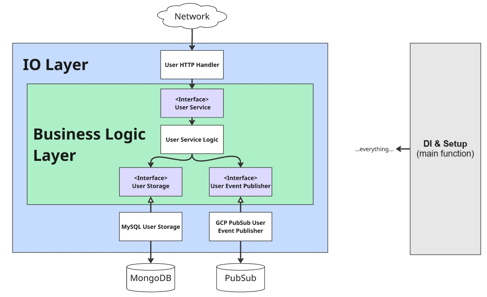

# Example Hexagonal Application for ZEALS

This application implements the Hexagonal source code structure shown in the following diagram.

# Explanation

_(More info coming later...)_

# Good Articles & Books

_(More info coming later...)_